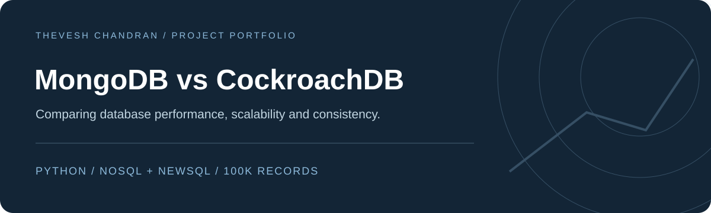

<h1 align="center">MongoDB vs CockroachDB</h1>

Comparing database performance, scalability and consistency.

<a href="#overview">Overview</a> · <a href="#explore">Explore</a> · <a href="#getting-started">Getting started</a>

## Overview

A comparative database coursework study using a 100,000-record sales dataset to explore MongoDB (NoSQL) and CockroachDB (NewSQL). Python scripts exercise reads, writes, aggregations and transaction behaviour across the two systems.

## Explore

| Experiment | CockroachDB | MongoDB |
|---|---|---|
| Performance | [Scripts](Performance%20-%20CockroachDB/) | [Scripts](Performance%20-%20MongoDB/) |
| Scalability | [Scripts](Scalability%20-%20CockroachDB/) | [Scripts](Scalability%20-%20MongoDB/) |
| Data consistency | [Scripts](Data%20Consistency%20-%20CockroachDB/) | [Scripts](Data%20Consistency%20-%20MongoDB/) |

- **Performance:** read/write latency, throughput and aggregation latency.
- **Scalability:** comparisons across one, two and three nodes or shards.
- **Consistency:** targeted atomicity, consistency, isolation and durability scenarios.

## Methodology

The coursework uses batches of 5,000 sales records and a local Windows 11 environment with a Ryzen 7 7730U processor and 16 GB RAM. The repository contains the [sales dataset](sales_data.csv) and experiment scripts.

These are configuration-specific experiments. Individual transaction scenarios demonstrate the tested behaviour and do not constitute a comprehensive guarantee about either database.

## Tech stack

Python · CockroachDB · MongoDB · PyMongo · PowerShell

## Getting started

Read the [experiment setup guide](docs/EXPERIMENT_GUIDE.md) for database preparation, schemas, cluster setup and individual test commands.

1. Install the database and Python dependencies required by the chosen script.
2. Create a dedicated local test database and prepare the appropriate schema.
3. Adjust connection settings and the path to `sales_data.csv` in the script.
4. Run the script from its experiment folder and record the output.

The original setup uses local development database configurations. Database services must be configured before the Python experiments can run.
